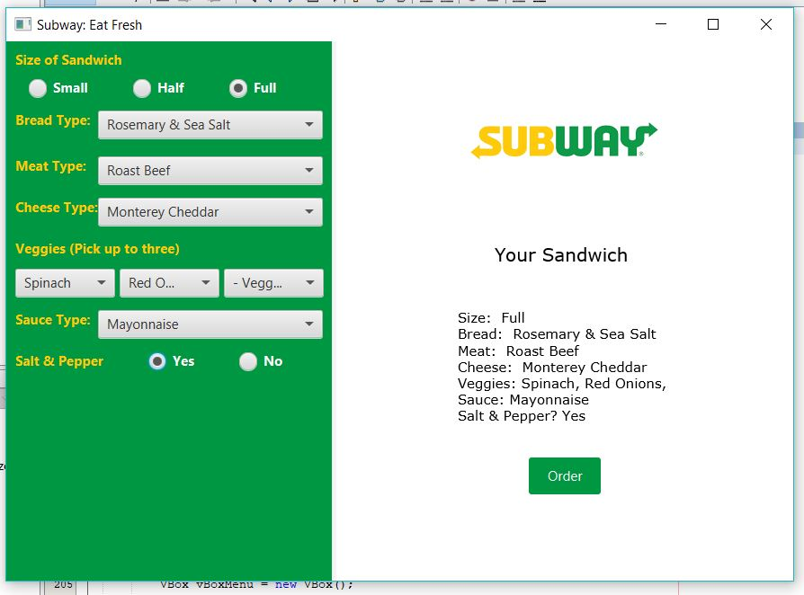

# Subway Order System

The Subway Order System application allows users to input the items they want on their sandwich. The items they can choose are sandwich size, bread type, meat type, cheese type, three vegetables, sauce type, and salt and pepper. The information is displayed using javafx and utilizes multiple input methods to accept user input. As the user inputs their choices, a summary of the sandwich is diaplayed.  

## Example Output

This image will display as your example output. Name the image README.jpg in your project folder.

## Analysis Steps

Step one was looking at the inputs required and creating a mockup of the screen we want to dispaly, includeing the summary output. 

Then we selected the inpute method for each ingredient. The input methods would be displayed on the left. 

Subway logo and summary output would be put on the right hand side of the screen. The summary output would be populated using listeners on each of the ingredient inputs from the left hand side of the screen. 

### Design

An input type was selected for each ingredient for the sandwich. We chose to use radio buttons to select sandwich size and if the user wants salt and pepper. These inputs were placed in HBoxes. For all other ingredients, we chose comboboxes for selecting from a list of ingredients. Each combobox is accompanied by a label. All ingredients that used comboboxes were placed in border panes to accomodate propper alignment of the elements within each row. Labels were aligned on the left, comboboxes on the right. All HBoxes and comboboxes were added to a VBox. 

A listener was created for each input. As the input was changed, the listener would pass that selection off to be handled. The selections are added to summary text and displayed in a VBox, along with the logo image and order button. 

Once both the seleciton vbox and output vbox are created, they are both added to an HBox. That HBox is then added to the scene. The scene is added to the primary stage and the screen is displayed. 

### Testing

The screen was dispalyed and analyzed to ensure all elemtns were displaying properly. Selections were input for each ingredient. As the ingredients were selected, we checked the summary to make sure the output matched the selection on the input. 

This was completed mulitple times using different selecitons for each input to ensure the summary output always matched the ingredient inputs. 
